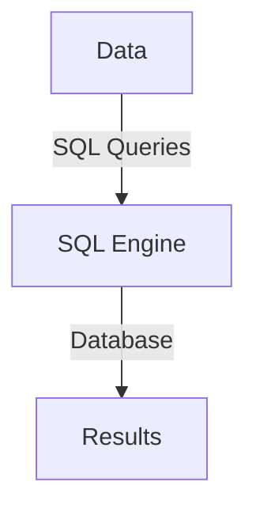
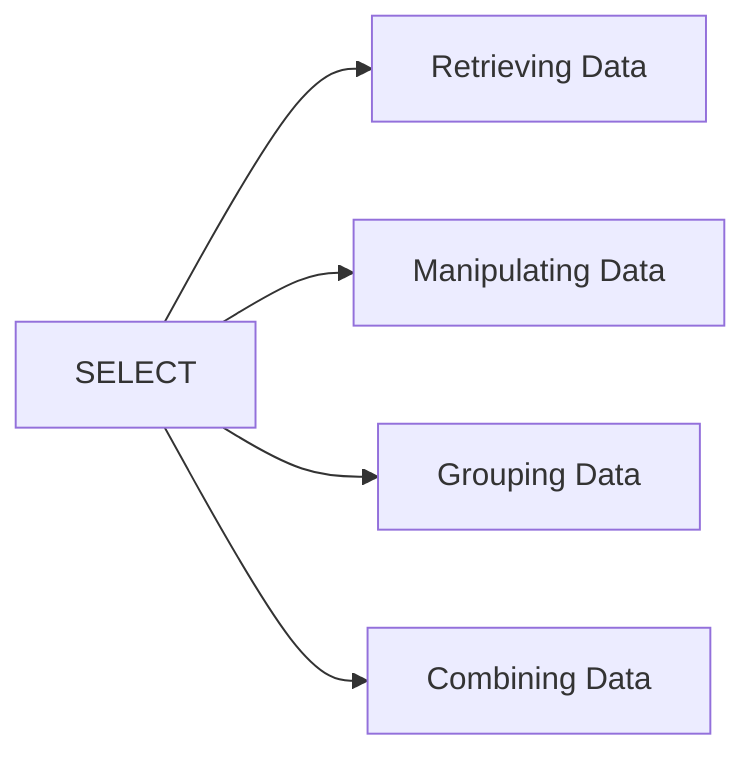
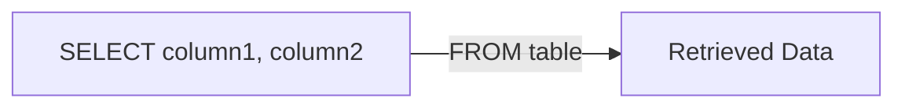
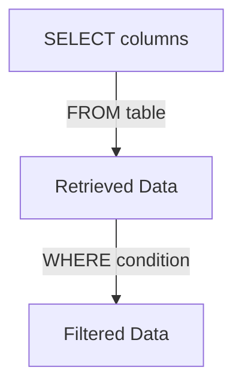
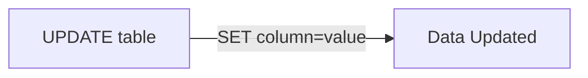
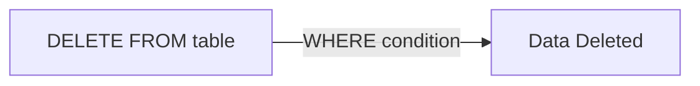
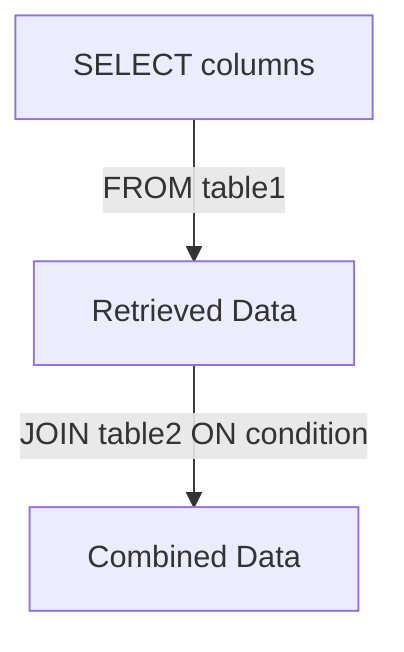
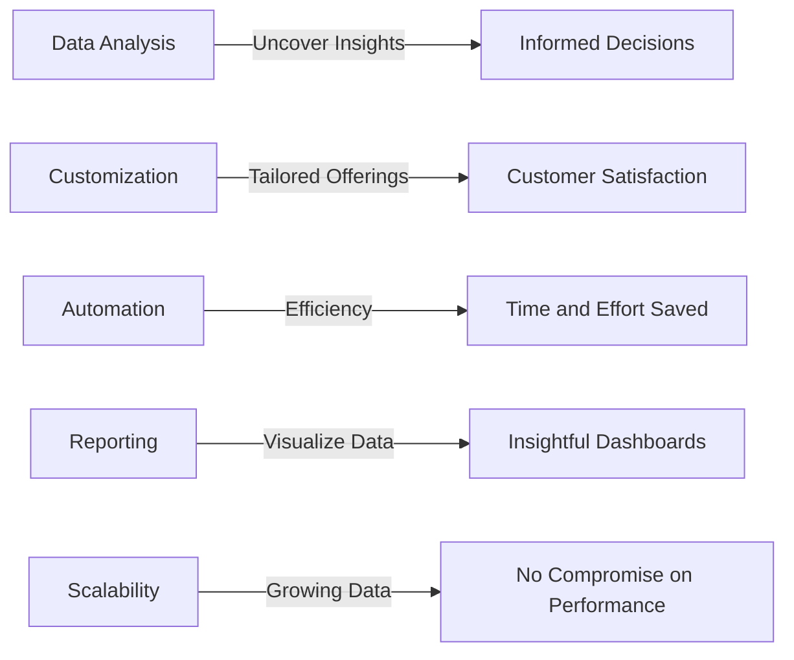
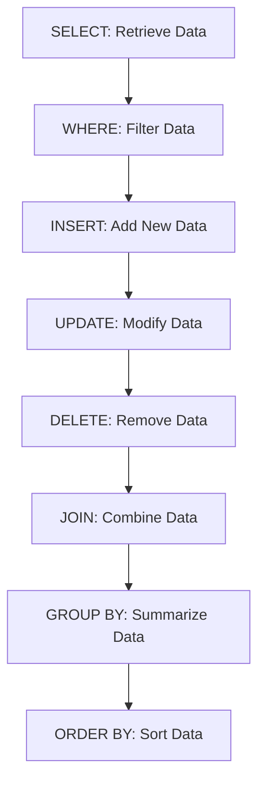
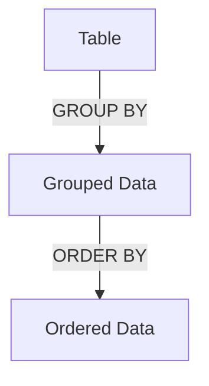

Absolutely, let's go through the presentation step by step with Mermaid diagrams for each concept:

**Introduction:**

*"Good day, everyone! Today, we're embarking on an exciting voyage into the realm of SQL. Imagine SQL as your trusty guide to navigating and organizing the vast sea of data in our digital lending domain, Lendsqr. It's like having a compass that points you to the right information at the right time. Today, we'll embark on our quest to understand the essence of SQL and how it empowers us at Lendsqr."*

**How SQL Works:**

*"Let's start with the foundation. Think of our data as a grand library filled with books, and SQL as the language that lets us ask questions about these books. It's as if we have a magical librarian who can find the exact book we're looking for, even in this enormous library."*



**Key SQL Functions:**

*"Now, let's delve into the magical functions that SQL bestows upon us."*



**SELECT Statement:**

*"Imagine you have a spotlight that illuminates only the parts of the stage you want to see."*



**WHERE Clause:**

*"Imagine you have a magnifying glass that helps you zoom in on specific items in a big collection."*



**INSERT Statement:**

*"Think of the INSERT statement as adding new players to our team roster."*

```mermaid
graph TD
  A[INSERT INTO table] -->|VALUES (data)| B[New Data Added]
```

**UPDATE Statement:**

*"Imagine updating a character's appearance in your favorite storybook. The UPDATE statement is just like that."*



**DELETE Statement:**

*"The DELETE statement is akin to removing a character from your story who's no longer needed."*



**GROUP BY and ORDER BY:**

*"Think of GROUP BY as sorting your toys into different boxes, and ORDER BY as arranging them neatly in each box."*

```mermaid
graph TD
  A[SELECT function(column)] -->|FROM table| B[Aggregated Data]
  B -->|GROUP BY column| C[Grouped Data]
  C -->|ORDER BY column| D[Ordered Data]
```

**JOIN:**

*"Imagine putting together pieces from different puzzles to reveal a bigger, complete picture. That's what JOIN does."*



**Benefits for Lendsqr:**

*"Now, let's see how these tools turn into treasures for Lendsqr."*



**Demo: Using SQL for Data Retrieval and Analysis**

**Opening the SQL Interface:**

*"Let's embark on a live demonstration of how SQL becomes our ally in fetching and interpreting data. Welcome to the SQL Server Management Studio, where the magic unfolds."*

**Writing the Query:**

*"Imagine sending a message to your data to get back the information you seek. Here's our query: 'Can you reveal the names of customers along with their approved loan amounts?' Let's craft the query."*
```
SELECT customer_name, loan_amount
FROM loans
WHERE status = 'approved';
```

**Running the Query:**

*"Let's press the 'Ask' button and watch the magic happen."*
(Run the query and display the results.)

**Adding More Complexity:**

*"Now, let's level up. Imagine you want to find the average loan amount for each type of loan. Let's shape this question into a query."*
```
SELECT loan_type, AVG(loan_amount)
FROM loans
GROUP BY loan_type;
```

**Running the Complex Query:**

*"Let's fire this query off and see the enlightening response."*
(Run the query and present the results.)

**Visualizing Data:**

*"The answers can transform into colorful insights. Imagine you're turning these answers into eye-catching charts and graphs. Tools like Excel can help you craft visual stories from your data."*

**Conclusion:**

*"And there you have it! Our journey through the heart of SQL and its magical tools is complete. Remember, SQL is our gateway to deciphering insights and making informed choices for our digital lending odyssey with Lendsqr."*

**Q&A Session:**

*"Before we wrap up, let's open the floor to any questions or curiosities you might have about SQL and how it paints its magic on Lendsqr."*

Feel free to adapt these descriptions to your presentation style and needs. Mermaid diagrams will significantly enhance the understanding of each concept for your audience.






